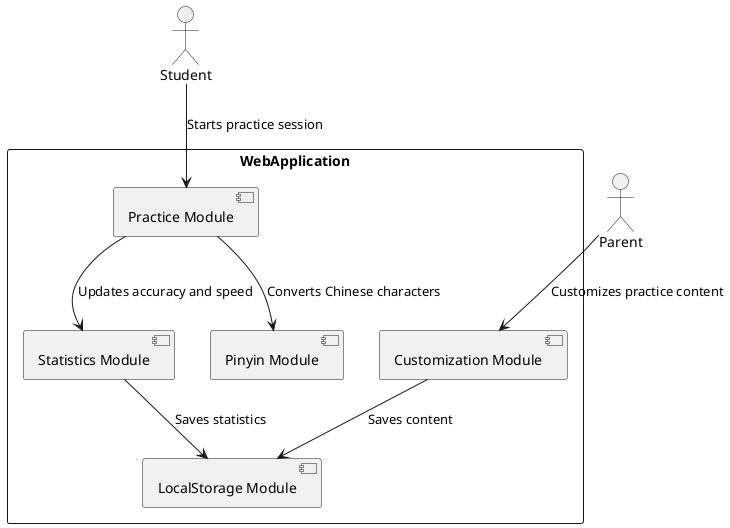
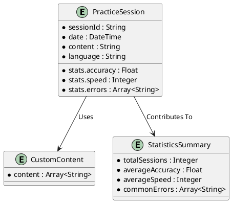

# **Software Architecture Design Document**

## **1. System Architecture**
The system architecture for the Typing Practice Program is designed to support a browser-based, single-page application (SPA) with LocalStorage for data persistence.

### **1.1 C4 Diagrams**

#### **Context Diagram**
```plantuml
@startuml
!include https://raw.githubusercontent.com/plantuml-stdlib/C4-PlantUML/master/C4_Context.puml

Person(student, "Student", "Young elementary school students (grades 1-3) practicing typing.")
Person(parent, "Parent", "Parents monitoring progress and customizing content.")

System_Boundary(typing_system, "Typing Practice System") {
    Container(web_app, "Web Application", "React, TypeScript, Tailwind CSS", "Provides typing practice and customization UI.")
    Container(localStorage, "LocalStorage", "Browser Storage", "Stores practice data locally without requiring an account system.")
}

Rel(student, web_app, "Uses", "HTTP")
Rel(parent, web_app, "Customizes and Monitors", "HTTP")
Rel(web_app, localStorage, "Reads/Writes", "LocalStorage API")

@enduml
```
- External users (students and parents) interact with the system via a web application.
- Data is stored locally using LocalStorage.

#### **Container Diagram**
```plantuml
@startuml
!include https://raw.githubusercontent.com/plantuml-stdlib/C4-PlantUML/master/C4_Container.puml

Person(student, "Student")
Person(parent, "Parent")

System_Boundary(typing_system, "Typing Practice System") {
    Container(web_app, "Web Application", "React, TypeScript, Tailwind CSS", "Provides typing practice and customization UI.")
    Container(localStorage, "LocalStorage", "Browser Storage", "Stores practice data locally without requiring an account system.")
}

ContainerDb(pinyinLib, "Pinyin Library", "JavaScript (pinyin.js)", "Handles Chinese character to pinyin conversion.")
ContainerDb(statsEngine, "Statistics Engine", "JavaScript", "Calculates accuracy, speed, and tracks errors.")

Rel(student, web_app, "Uses", "HTTP")
Rel(parent, web_app, "Customizes and Monitors", "HTTP")
Rel(web_app, localStorage, "Reads/Writes", "LocalStorage API")
Rel(web_app, pinyinLib, "Uses", "JS")
Rel(web_app, statsEngine, "Uses", "JS")

@enduml
```
- Frontend: React-based single-page application (SPA).
- Backend Logic: Handled in-browser with JavaScript for statistics calculation and Pinyin conversion.
- LocalStorage: For storing practice data.

#### **Component Diagram**
```plantuml
@startuml
!include https://raw.githubusercontent.com/plantuml-stdlib/C4-PlantUML/master/C4_Component.puml

Container(web_app, "Web Application", "React, TypeScript, Tailwind CSS", "Provides typing practice and customization UI.")

Component(practiceModule, "Practice Module", "TypeScript", "Manages typing practice sessions for both English and Chinese.")
Component(customizationModule, "Customization Module", "TypeScript", "Allows parents to customize practice content.")
Component(statsModule, "Statistics Module", "TypeScript", "Tracks and displays accuracy, speed, and common error words.")
Component(pinyinModule, "Pinyin Module", "JavaScript (pinyin.js)", "Converts Chinese characters to pinyin for practice.")
Component(localStorageModule, "LocalStorage Module", "JavaScript", "Handles saving and loading practice data from LocalStorage.")

Rel(practiceModule, pinyinModule, "Uses", "JS")
Rel(practiceModule, statsModule, "Updates", "JS")
Rel(customizationModule, localStorageModule, "Saves Content", "JS")
Rel(statsModule, localStorageModule, "Saves/Loads Stats", "JS")

@enduml
```
- Example: The `Practice Module` interacts with the `Pinyin Module` for Chinese practice and updates the `Statistics Module`.

### **1.2 Component Interaction Flowchart**


---

## **2. Technology Stack**
The technology stack is chosen to align with modern web development practices and ensure cross-browser compatibility.

### **2.1 Programming Languages**
- Frontend: TypeScript (for type safety and scalability).
- Backend Logic: TypeScript (handled in-browser).

### **2.2 Frameworks**
- Frontend: React (for building dynamic and responsive UI components).
- Styling: Tailwind CSS (for utility-first styling).

### **2.3 Libraries**
- Pinyin Conversion: `pinyin.js`.
- Statistics Calculation: Custom-built module in TypeScript.

### **2.4 Data Storage**
- LocalStorage: Browser-based storage for saving practice data locally.
- JSON Export/Import: For backing up and restoring data externally.

### **2.5 Build Tools**
- Package Manager: npm.
- Bundler: Vite.

### **2.6 Testing**
- Unit Testing: Jest.
- End-to-End Testing: Cypress.

---

## **3. Data Model**
The data model is designed for simplicity and efficiency using LocalStorage.

### **3.1 LocalStorage Schema**

#### **Practice Session Data**
```json
{
  "sessionId": "2023-10-05-001",
  "date": "2023-10-05T14:48:00Z",
  "content": "The quick brown fox jumps over the lazy dog.",
  "language": "English",
  "stats": {
    "accuracy": 95.0,
    "speed": 45,
    "errors": ["quic", "lzy"]
  }
}
```

#### **Customization Content**
```json
[
  "The quick brown fox jumps over the lazy dog.",
  "狐狸跳过了懒惰的狗。",
  "Practice makes perfect."
]
```

#### **Statistics Summary**
```json
{
  "totalSessions": 10,
  "averageAccuracy": 92.5,
  "averageSpeed": 40,
  "commonErrors": ["quic", "lzy", "fox"]
}
```

### **3.2 Entity Relationship Diagram (ERD)**


---

## **4. Interface Design**
The interface design ensures seamless interaction between modules and provides JSON import/export functionality.

### **4.1 JSON Import/Export API**
- **Export Data**: Exports all practice sessions, customization content, and statistics as a JSON file.
- **Import Data**: Imports a JSON file to restore data.

### **4.2 Module-to-Module Interfaces**
- **Practice Module**: Manages typing practice sessions.
- **Customization Module**: Allows parents to customize practice content.
- **Statistics Module**: Tracks and displays accuracy, speed, and errors.
- **Pinyin Module**: Converts Chinese characters to pinyin.
- **LocalStorage Module**: Handles saving and loading data.

---

## **5. Deployment Architecture**
The deployment architecture focuses on hosting static assets and ensuring cross-browser compatibility.

### **5.1 Cloud Environment**
- Hosting: AWS S3.
- CDN: CloudFront.
- CI/CD Pipeline: GitHub Actions.

### **5.2 Security**
- HTTPS Enforcement: SSL/TLS certificates.
- Content Security Policy (CSP): Prevent XSS attacks.
- Input Validation: Ensure only valid text is accepted.

---

## **6. Repository Structure**
The repository is organized for maintainability and ease of navigation.

```
typing-practice-program/
├── public/               # Static assets
│   ├── index.html        # Main HTML file
│   └── assets/           # Images, fonts, etc.
├── src/                  # Source code files
│   ├── components/       # Reusable UI components
│   │   ├── PracticeArea.tsx
│   │   ├── StatsDisplay.tsx
│   │   └── CustomContentEditor.tsx
│   ├── modules/          # Core logic modules
│   │   ├── practiceModule.ts
│   │   ├── statsModule.ts
│   │   ├── pinyinModule.ts
│   │   └── localStorageModule.ts
│   ├── App.tsx           # Main application entry point
│   ├── index.tsx         # React DOM rendering
│   └── styles/           # Tailwind CSS configuration
│       └── tailwind.config.js
├── tests/                # Test files
│   ├── unit/             # Unit tests
│   │   ├── practiceModule.test.ts
│   │   ├── statsModule.test.ts
│   │   └── pinyinModule.test.ts
│   └── e2e/              # End-to-end tests
│       └── cypress/      # Cypress test suite
├── config/               # Configuration files
│   ├── vite.config.js    # Vite build configuration
│   └── jest.config.js    # Jest testing configuration
├── package.json          # Project dependencies and scripts
└── README.md             # Project overview and setup instructions
```