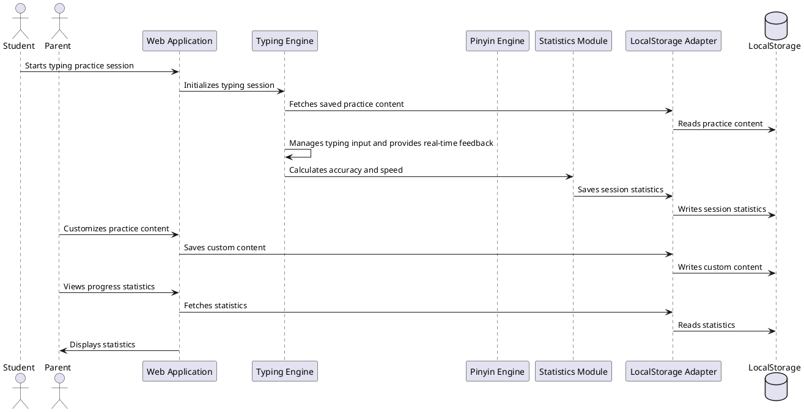
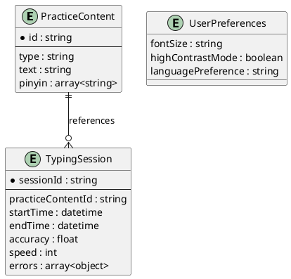

# **Software Architecture Design Document**

## **1. System Architecture**
The system architecture for the Typing Practice is designed to support a cross-platform web application with local data persistence using LocalStorage. It consists of multiple internal modules interacting through well-defined interfaces.

### **1.1 C4 Diagrams**

#### **Context Diagram**
```plantuml
@startuml
!include https://raw.githubusercontent.com/plantuml-stdlib/C4-PlantUML/master/C4_Context.puml

Person(student, "Student", "Young elementary school students (grades 1-3)")
Person(parent, "Parent", "Parents of elementary school students")
System(typingPracticeApp, "Typing Practice Web App", "A web application for improving typing skills in English and Chinese")

Rel(student, typingPracticeApp, "Uses")
Rel(parent, typingPracticeApp, "Customizes and Monitors")

System_Ext(browser, "Web Browser", "Any modern web browser")
System_Ext(localStorage, "LocalStorage", "Local storage mechanism within the browser")

Rel(typingPracticeApp, browser, "Runs on")
Rel(typingPracticeApp, localStorage, "Stores data in")
@enduml
```
- External users (students and parents) interact with the system via a web browser.
- The web application stores all data locally using LocalStorage.

#### **Container Diagram**
```plantuml
@startuml
!include https://raw.githubusercontent.com/plantuml-stdlib/C4-PlantUML/master/C4_Container.puml

Person(student, "Student")
Person(parent, "Parent")
System_Boundary(typingPracticeApp, "Typing Practice Web App") {
    Container(webApp, "Web Application", "React + TypeScript", "Frontend application handling user interactions")
    ContainerDb(localStorage, "LocalStorage", "Browser's LocalStorage", "Stores practice data, statistics, and configurations")
}

Rel(student, webApp, "Uses")
Rel(parent, webApp, "Customizes and Monitors")
Rel(webApp, localStorage, "Reads from and writes to")
@enduml
```
- **Frontend**: React-based SPA with TypeScript.
- **Data Storage**: LocalStorage for storing practice content, statistics, and configurations.

#### **Component Diagram**
```plantuml
@startuml
!include https://raw.githubusercontent.com/plantuml-stdlib/C4-PlantUML/master/C4_Component.puml

Container(webApp, "Web Application", "React + TypeScript", "Handles user interactions and displays content")
Component(typingEngine, "Typing Engine", "JavaScript/TypeScript", "Manages typing practice logic and feedback")
Component(pinyinEngine, "Pinyin Engine", "JavaScript/TypeScript", "Handles pinyin input for Chinese characters")
Component(statisticsModule, "Statistics Module", "JavaScript/TypeScript", "Calculates and displays typing statistics")
Component(localStorageAdapter, "LocalStorage Adapter", "JavaScript/TypeScript", "Interfaces with LocalStorage")

Rel(webApp, typingEngine, "Uses for practice sessions")
Rel(webApp, pinyinEngine, "Uses for Chinese practice")
Rel(webApp, statisticsModule, "Uses for displaying stats")
Rel(webApp, localStorageAdapter, "Uses for data persistence")
Rel(localStorageAdapter, localStorage, "Reads from and writes to")
@enduml
```
- Example: "Typing Engine" contains components like `TypingController`, `FeedbackGenerator`, and `ProgressTracker`.

### **1.2 Component Interaction Flowchart**

- A student starts a typing practice session → Typing Engine fetches content and manages input → Feedback is provided in real-time → Statistics are calculated and saved.
- A parent customizes practice content → Content is saved to LocalStorage → Parent views progress statistics → Statistics are fetched and displayed.

---

## **2. Technology Stack**

### **2.1 Programming Languages**
- Frontend: TypeScript, React, Vite.

### **2.2 Frameworks & Libraries**
- Frontend Framework: Vite, TypeScript and React.
- Styling: Tailwind CSS for responsive and utility-first styling.
- Pinyin Support: `pinyin.js` library for handling Chinese pinyin input validation.
- State Management: Context API for managing global state (e.g., practice content, statistics).
- JSON Export: FileSaver.js for exporting practice data as JSON files.

### **2.3 Testing & Quality Assurance**
- Unit Testing: vitest for unit tests.
- Integration Testing: React Testing Library for integration tests.
- End-to-End Testing: Cypress for simulating user interactions across the entire application.

### **2.4 Development & Deployment Tools**
- Version Control: GitHub for version control and collaboration.
- CI/CD Pipeline: GitHub Actions for automated testing and deployment.
- Hosting: AWS S3 + CloudFront for deploying the frontend web application, ensuring fast and reliable hosting with automatic SSL.

---

## **3. Data Model**
The data model is designed to support LocalStorage for persisting practice content, typing sessions, and user preferences.

### **3.1 Core Entities**

#### **Practice Content**
```json
{
  "id": "content_001",
  "type": "english", // "english" or "chinese"
  "text": "The quick brown fox jumps over the lazy dog.",
  "pinyin": ["The", "quick", "brown", "fox", "jumps", "over", "the", "lazy", "dog"]
}
```

#### **Typing Session**
```json
{
  "sessionId": "session_001",
  "practiceContentId": "content_001",
  "startTime": "2023-10-05T14:48:00Z",
  "endTime": "2023-10-05T14:50:00Z",
  "accuracy": 95.6, // Percentage
  "speed": 120, // Characters per minute (CPM)
  "errors": [
    {
      "character": "q",
      "expected": "w",
      "position": 5
    }
  ]
}
```

#### **User Preferences**
```json
{
  "fontSize": "large", // "small", "medium", "large"
  "highContrastMode": true,
  "languagePreference": "english" // "english" or "chinese"
}
```

### **3.2 Entity Relationship Diagram (ERD)**


---

## **4. Interface Design**
The interface design ensures seamless communication between internal modules and LocalStorage.

### **4.1 Internal API Endpoints**

#### **Practice Content Management**
- **Create/Update Practice Content**:  
  - Method: `POST`
  - Endpoint: `/api/practice-content` *(internal module call)*
  - Request Body:
    ```json
    {
      "id": "content_001",
      "type": "english",
      "text": "The quick brown fox jumps over the lazy dog.",
      "pinyin": ["The", "quick", "brown", "fox", "jumps", "over", "the", "lazy", "dog"]
    }
    ```

#### **Typing Session Management**
- **Save Typing Session**:  
  - Method: `POST`
  - Endpoint: `/api/typing-session` *(internal module call)*
  - Request Body:
    ```json
    {
      "sessionId": "session_001",
      "practiceContentId": "content_001",
      "startTime": "2023-10-05T14:48:00Z",
      "endTime": "2023-10-05T14:50:00Z",
      "accuracy": 95.6,
      "speed": 120,
      "errors": [
        {
          "character": "q",
          "expected": "w",
          "position": 5
        }
      ]
    }
    ```

#### **User Preferences**
- **Save User Preferences**:  
  - Method: `POST`
  - Endpoint: `/api/user-preferences` *(internal module call)*
  - Request Body:
    ```json
    {
      "fontSize": "large",
      "highContrastMode": true,
      "languagePreference": "english"
    }
    ```

### **4.2 Message Formats**
All internal API calls will use **JSON** as the message format for request/response payloads.

---

## **5. Deployment Architecture**
The deployment architecture leverages **AWS S3 + CloudFront** for hosting and **GitHub Actions** for CI/CD.

### **5.1 Cloud Environment**
- **Frontend Hosting**:  
  - **Amazon S3**: Hosts static assets (HTML, CSS, JavaScript/TypeScript files) for the React-based SPA.
  - **Amazon CloudFront**: Acts as a Content Delivery Network (CDN) to cache and distribute the static assets globally for faster load times.

### **5.2 Security Considerations**
- **HTTPS Enforcement**:  
  - CloudFront automatically provides SSL/TLS certificates via AWS Certificate Manager (ACM), ensuring that all traffic between users and the application is encrypted.
  
- **S3 Bucket Policies**:  
  - The S3 bucket containing the static assets will have strict bucket policies to prevent unauthorized access. Only CloudFront will have read access to the bucket, while direct public access to the bucket will be disabled.

- **CORS Configuration**:  
  - Cross-Origin Resource Sharing (CORS) rules will be configured in the S3 bucket to allow only specific origins (e.g., your domain) to access the resources.

### **5.3 Scalability and Performance**
- **Global Content Delivery**:  
  - CloudFront ensures low-latency access by caching content at edge locations around the world. This improves performance for users regardless of their geographic location.
  
- **Static Asset Optimization**:  
  - The React application will be built with optimized assets (minified JavaScript, CSS, and images) to reduce load times.
  - Gzip/Brotli compression will be enabled on CloudFront to further optimize asset delivery.

### **5.4 CI/CD Pipeline Workflow**
Here’s how the CI/CD pipeline will work with **GitHub Actions**:

1. **Trigger**:  
   - The pipeline is triggered on every push to the `main` branch or when a new release is created.

2. **Build Phase**:
   - Install dependencies: `npm install`.
   - Build the React application: `npm run build`.

3. **Test Phase**:
   - Run unit tests: `npm test`.
   - Run end-to-end tests (optional): Cypress tests can be run in a headless browser environment.

4. **Deploy Phase**:
   - Sync the built static files to the S3 bucket using the AWS CLI:  
     ```bash
     aws s3 sync build/ s3://your-bucket-name --delete
     ```
   - Invalidate the CloudFront cache to ensure the latest version is served:  
     ```bash
     aws cloudfront create-invalidation --distribution-id YOUR_DISTRIBUTION_ID --paths "/*"
     ```

### **5.5 Monitoring & Logging**
- **CloudWatch Logs**:  
  - Enable logging for S3 and CloudFront to monitor access patterns and troubleshoot issues.
  
- **Error Monitoring**:  
  - Use tools like **Sentry** or **LogRocket** to capture frontend errors and monitor user interactions in real-time.

---

## **6. Repository Structure**
The repository is organized to ensure maintainability and ease of navigation.

```
typing-practice/
├── public/                 # Static public assets (served as-is)
├── src/                    # Application source code
│   ├── assets/             # Images, fonts, etc. imported in code
│   ├── components/         # Reusable React components
│   ├── context/            # React context providers for global state
│   ├── hooks/              # Custom React hooks
│   ├── lib/                # Library code, helpers, constants
│   ├── styles/             # Global CSS (optional, Tailwind preferred)
│   ├── utils/              # Utility functions
│   └── main.tsx            # App entry point
├── docs/                   # Project documentation
├── index.html              # Main HTML file loaded by Vite
├── package.json            # Project manifest
├── package-lock.json       # Dependency lock file
├── tsconfig.json           # TypeScript config
├── tsconfig.app.json       # (Optional) App-specific TS config
├── vite.config.ts          # Vite config
├── tailwind.config.js      # Tailwind CSS config
├── eslint.config.js        # ESLint config
└── README.md               # Project overview and setup
```
